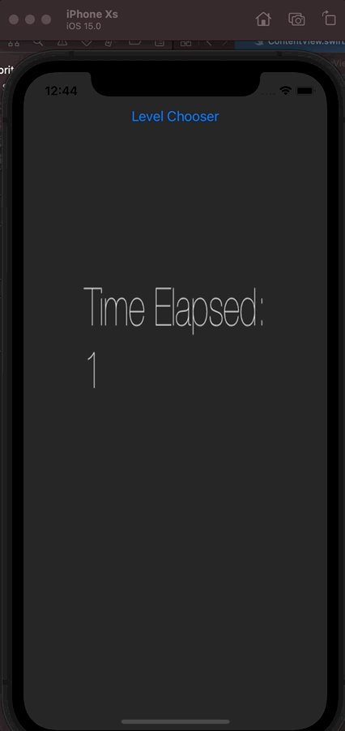

# SpriteView-isPaused

**-> UPDATE: [FIXED in the `fixed` branch](https://github.com/clns/SpriteView-isPaused/tree/fixed)**

Sample SwiftUI / SpriteKit Xcode 13 project showing how the `SKScene` is recreated every time the state property given to the `SpriteView(scene: isPaused:)` initializer changes.

Related questions:

- [Pause a SpriteKit scene from SwiftUI using SpriteView(isPaused:), without reinitializing it every time?](https://stackoverflow.com/questions/69442079/pause-a-spritekit-scene-from-swiftui-using-spriteviewispaused-without-reinit)
- [How can you pause a SpriteKit scene from SwiftUI, without reinitializing it every time?](https://developer.apple.com/forums/thread/691607)



All the code is in [ContentView.swift](https://github.com/clns/SpriteView-isPaused/blob/main/SpriteView-isPaused/ContentView.swift):

```swift
import SwiftUI
import SpriteKit

class GameScene: SKScene {
    private let label = SKLabelNode(text: "Time Elapsed:\n0")
    private var lastUpdateTime : TimeInterval = 0
    
    override func didMove(to view: SKView) {
        addChild(label)
    }
    
    override func update(_ currentTime: TimeInterval) {
        if (self.lastUpdateTime == 0) {
            self.lastUpdateTime = currentTime
        }
        
        let seconds = Int(currentTime - lastUpdateTime)
        label.text = "Time Elapsed:\n\(seconds)"
        label.numberOfLines = 2
    }
}

struct ContentView: View {
    @State private var showingLevelChooser = false
    
    var scene: SKScene {
        let scene = GameScene()
        scene.size = CGSize(width: 300, height: 400)
        scene.anchorPoint = CGPoint(x: 0.5, y: 0.5)
        scene.scaleMode = .fill
        return scene
    }
    
    var body: some View {
        ZStack {
            SpriteView(scene: scene, isPaused: showingLevelChooser)
                .ignoresSafeArea()
            VStack {
                Button("Level Chooser") {
                    showingLevelChooser.toggle()
                }
                Spacer()
            }
        }
        .sheet(isPresented: $showingLevelChooser) {
            VStack {
                Button("Cancel") {
                    showingLevelChooser.toggle()
                }
                Text("Level Chooser")
            }
        }
    }
}
```
